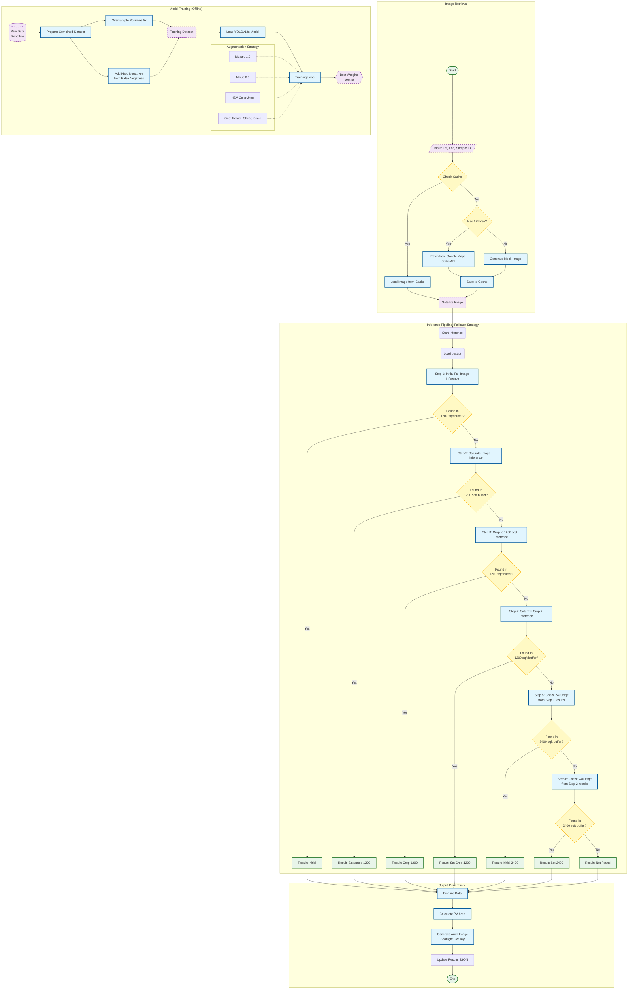

```mermaid
flowchart TD
    %% Define Styles
    classDef process fill:#e1f5fe,stroke:#01579b,stroke-width:2px;
    classDef decision fill:#fff9c4,stroke:#fbc02d,stroke-width:2px;
    classDef terminator fill:#e8f5e9,stroke:#2e7d32,stroke-width:2px;
    classDef data fill:#f3e5f5,stroke:#7b1fa2,stroke-width:2px,stroke-dasharray: 5 5;

    %% Main Subgraphs
    subgraph RETRIEVAL ["Image Retrieval"]
        Start([Start]) --> InputData[/Input: Lat, Lon, Sample ID/]
        InputData --> CheckCache{Check Cache}
        CheckCache -- Yes --> LoadCache[Load Image from Cache]
        CheckCache -- No --> CheckAPI{Has API Key?}
        CheckAPI -- Yes --> FetchAPI[Fetch from Google Maps Static API]
        CheckAPI -- No --> MockImg[Generate Mock Image]
        FetchAPI --> SaveCache[Save to Cache]
        MockImg --> SaveCache
        LoadCache --> SatImage(Satellite Image)
        SaveCache --> SatImage
    end

    subgraph TRAINING ["Model Training (Offline)"]
        RawData[(Raw Data\nRoboflow)] --> PrepData[Prepare Combined Dataset]
        PrepData --> Oversample[Oversample Positives 5x]
        PrepData --> HardNeg[Add Hard Negatives\nfrom False Negatives]
        Oversample & HardNeg --> Dataset(Training Dataset)
        
        Dataset --> LoadModel[Load YOLOv12x Model]
        LoadModel --> TrainLoop[Training Loop]
        
        subgraph Augmentation ["Augmentation Strategy"]
           Aug1[Mosaic 1.0]
           Aug2[Mixup 0.5]
           Aug3[HSV Color Jitter]
           Aug4[Geo: Rotate, Shear, Scale]
        end
        
        %% Fix: Connect nodes inside subgraph to the loop, not the subgraph itself
        Aug1 & Aug2 & Aug3 & Aug4 -.-> TrainLoop
        TrainLoop --> BestWeights{{Best Weights\nbest.pt}}
    end

    subgraph INFERENCE ["Inference Pipeline (Fallback Strategy)"]
        SatImage --> InfStart(Start Inference)
        InfStart --> LoadWeights(Load best.pt)
        
        %% Step 1: Initial Full
        LoadWeights --> Step1[Step 1: Initial Full Image Inference]
        Step1 --> Check1200{Found in\n1200 sqft buffer?}
        Check1200 -- Yes --> ResultInitial[Result: Initial]

        %% Step 2: Saturated Full
        Check1200 -- No --> Step2[Step 2: Saturate Image + Inference]
        Step2 --> CheckSat1200{Found in\n1200 sqft buffer?}
        CheckSat1200 -- Yes --> ResultSat[Result: Saturated 1200]

        %% Step 3: Cropped
        CheckSat1200 -- No --> Step3[Step 3: Crop to 1200 sqft + Inference]
        Step3 --> CheckCrop1200{Found in\n1200 sqft buffer?}
        CheckCrop1200 -- Yes --> ResultCrop[Result: Crop 1200]

        %% Step 4: Saturated Crop
        CheckCrop1200 -- No --> Step4[Step 4: Saturate Crop + Inference]
        Step4 --> CheckSatCrop1200{Found in\n1200 sqft buffer?}
        CheckSatCrop1200 -- Yes --> ResultSatCrop[Result: Sat Crop 1200]

        %% Step 5: Check 2400 Initial
        CheckSatCrop1200 -- No --> Step5[Step 5: Check 2400 sqft\nfrom Step 1 results]
        Step5 --> Check2400{Found in\n2400 sqft buffer?}
        Check2400 -- Yes --> Result2400[Result: Initial 2400]

        %% Step 6: Check 2400 Saturated
        Check2400 -- No --> Step6[Step 6: Check 2400 sqft\nfrom Step 2 results]
        Step6 --> CheckSat2400{Found in\n2400 sqft buffer?}
        CheckSat2400 -- Yes --> ResultSat2400[Result: Sat 2400]
        
        CheckSat2400 -- No --> ResultNone[Result: Not Found]
    end

    subgraph OUTPUT ["Output Generation"]
        ResultInitial & ResultSat & ResultCrop & ResultSatCrop & Result2400 & ResultSat2400 & ResultNone --> Finalize[Finalize Data]
        Finalize --> CalcArea[Calculate PV Area]
        CalcArea --> GenAudit[Generate Audit Image\nSpotlight Overlay]
        GenAudit --> JSON[Update Results JSON]
        JSON --> End([End])
    end

    %% Styles
    %% Fix: Changed 'ub' to 'terminator' as 'ub' was not defined
    class Start,End terminator
    class InputData,SatImage,RawData,Dataset,BestWeights data
    class LoadCache,FetchAPI,MockImg,SaveCache,PrepData,Oversample,HardNeg,LoadModel,TrainLoop,Step1,Step2,Step3,Step4,Step5,Step6,Finalize,CalcArea,GenAudit process
    class CheckCache,CheckAPI,Check1200,CheckSat1200,CheckCrop1200,CheckSatCrop1200,Check2400,CheckSat2400 decision
    class ResultInitial,ResultSat,ResultCrop,ResultSatCrop,Result2400,ResultSat2400,ResultNone terminator
```
